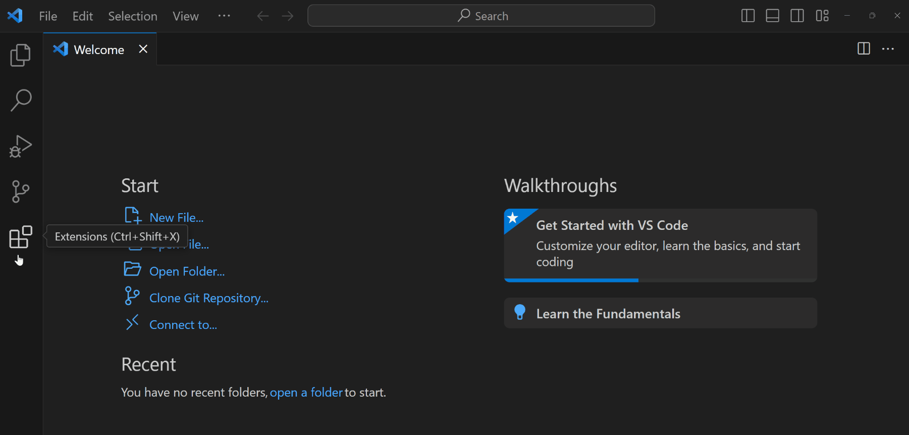

# Introduction

The bioinformatics and computational biology discipline has seen dramatic growth in the last decade and is projected to continue growing.[^1] As the field continues to evolve, the software and computational tools do as well, so having a reliable and stable workflow is essential.

Everyone has a prefered coding workflow, and no one setup is perfect. That being said, I have found that the combination of **Visual Studio Code** (VSCode) for IDE, **Quarto** for creating notebooks, and **Mamba** for package management is a dynamic and powerful **bioinformatics workflow in 2024**!

[^1]: [Bioinformatics Market Size, Share & Trends Analysis Report](https://www.grandviewresearch.com/industry-analysis/bioinformatics-industry){target="_blank"}

# Quick Start

> **Attention Windows Users**: This tutorial is tailored towards MacOS and Linux OS. For dedicated Windows users, I recommend this [blog post](https://medium.com/@larysha.rothmann/getting-started-with-wsl-for-bioinformatics-setting-up-a-fully-functional-and-pretty-53b9c79b5380){target="_blank"} by Larysha Rothmann.

1. Install [VSCode](https://code.visualstudio.com/download){target="_blank"} and relevant extensions:
    - R
    - Python
    - Quarto

2. Install [Quarto](https://quarto.org/docs/get-started/){target="_blank"} for creating rich text documents.

3. Download [miniforge](https://github.com/conda-forge/miniforge#Download){target="_blank"} for creating stable and reproducible coding environments.

```bash
# Run the following commands in your VSCode terminal. press: (ctrl + `)
curl -L -O "https://github.com/conda-forge/miniforge/releases/latest/download/Miniforge3-$(uname)-$(uname -m).sh"
bash Miniforge3-$(uname)-$(uname -m).sh
```

4. Clone the [bioinfo-2024](https://github.com/dombraccia/bioinfo-2024.git){target="_blank"} repository.

```bash
git clone https://github.com/dombraccia/bioinfo-2024.git
cd bioinfo-2024
```

5. Create a stable coding environment with [mamba](https://mamba.readthedocs.io/en/latest/user_guide/mamba.html#mamba){target="_blank"}.

```bash
# in the bioinfo-2024/ directory
mamba env create -n bioinfo python=3.12 -f environment.yml
```

6. Render the example Quarto notebook to test your environment setup.

```bash
quarto render bioinfo-2024.qmd --to html
```

**BONUS**: Convert your Quarto notebook to a Jupyter notebook.

```bash
quarto convert bioinfo-2024.qmd --to ipynb
```

# Instructions

## 1. Install Visual Studio Code

I use [VSCode](https://code.visualstudio.com/){target="_blank"} for almost all of my coding tasks. With extensions for Git, Jupyter, Docker, Remote-SSH, and linters for R, Python, Julia, and almost any coding language you can imagine, it is an extremely versatile IDE.[^3]

[^3]: Alternatives to VSCode include: [Rstudio](https://www.rstudio.com/products/rstudio/download/), [Jupyter Lab](https://jupyter.org/install){target="_blank"}, and [PyCharm](https://www.jetbrains.com/pycharm/download/){target="_blank"}. Ultimately, your choice of IDE essentially comes down to personal preference, so don't spend too much time thinking about it.

After you have installed VSCode, install extensions for: 

- R
- Python 
- Quarto



## 2. Install Quarto

[Quarto](https://quarto.org/docs/get-started/){target="_blank"} is a document authoring tool that allows you to create rich text documents with code, output, and narrative text. It is a great tool for mixing code, explainations, and any interesting results you find. I mostly choose Quarto over Jupyter notebooks[^2] for the following reasons:

[^2]: The one instance in which I still use Jupyter notebooks/Jupyter Lab over Quarto is when I need my notebook environment to stay running for a long time. This can happen when processing large single cell datasets and running compute-heavy ML models that can sometimes take days to train.

- <u>Language agnostic</u>: Quarto allows you to code in multiple languages in the same document. This is highly relevant in bioinformatics where you may need to switch between R and Python regularly for access to different packages.
- <u>Version control</u>: Quarto documents are plain text files, making them easy to version control with Git.
- <u>Customizable output</u>: You can output your document in multiple formats (HTML, PDF, Word, etc.) with a single command.
- <u>Conversion to Jupyter notebooks</u>: Quarto documents can easily be converted to Jupyter notebooks and vice versa, so you are never locked-in to one notebook system.

## 3. Download Miniforge (`mamba`)

[Miniforge](https://github.com/conda-forge/miniforge?tab=readme-ov-file#miniforge){target="_blank"} is a package manager based on [Conda](https://docs.conda.io/en/latest/){target="_blank"}. It allows you to create isolated coding environments with specific package versions required for your project. I prefer miniforge (`mamba`) over Anaconda or Miniconda because it is faster and more efficient. And if you're already familiar with conda environments, just replace `conda` with `mamba` in your commands and you are good to go!

To install Miniforge, run the following commands in your VSCode terminal:

```bash
# Run the following commands in your VSCode terminal. press: (ctrl + `)
curl -L -O "https://github.com/conda-forge/miniforge/releases/latest/download/Miniforge3-$(uname)-$(uname -m).sh"
bash Miniforge3-$(uname)-$(uname -m).sh
```

Alternatively, you can use `wget` to download the Miniforge installer:

```bash
wget "https://github.com/conda-forge/miniforge/releases/latest/download/Miniforge3-$(uname)-$(uname -m).sh"
bash Miniforge3-$(uname)-$(uname -m).sh
```

We will return to this part after step 4, cloning a git repository.

## 4. `git clone` a repository

We will now work out of a repo set up with a minimal example of a bioinformatics analysis project. This next part required that you have Git downloaded, so if you don't have it yet, you can download it [here](https://git-scm.com/downloads){target="_blank"}.

```bash
# Run the following commands in your VSCode terminal. press: (ctrl + `)
git clone https://github.com/dombraccia/bioinfo-2024.git
cd bioinfo-2024
```

Now, we can get back to creating a `mamba` environment.

## 5. Create a `mamba` environment

Once you have Miniforge installed, and you are in the `bioinfo-2024/` folder, we can create a new mamba environment. The following code will:

1. create a new mamba environment named `bioinfo-2024`
2. selects python version 3.12
3. installs the packages listed in the `environment.yml` file
4. activates the `bioinfo-2024` environment

```bash
# run these commands in the VSCode terminal
mamba create -n bioinfo python=3.12 -f environment.yml
mamba activate bioinfo
```

Oops! We forgot to add the `numpy` package to the `environment.yml` file. Let's add it now:

```bash
# make sure you have the bioinfo environment activated
mamba install numpy
```

You can always add packages to an active mamba environment with `mamba install`. 

Learn more about customizing yml files [here](https://mamba.readthedocs.io/en/latest/user_guide/mamba.html#yml-files){target="_blank"}.

## 6. Render a Quarto document

To test your environment setup, render the `bioinfo-2024.qmd` notebook:

```bash
# in the bioinfo-2024/ directory
quarto render bioinfo-2024.qmd --to html
```

This command will render the Quarto document to HTML by default, but it also supports PDF, Word, and other formats. 

But by far my favorite feature of the quarto cli, is the `quarto convert` command:

```bash
# Convert qmd <==> ipynb by default, or specify the output format (pdf, html, ...) 
quarto convert bioinfo-2024.qmd --to ipynb
quarto convert bioinfo-2024.ipynb --to qmd
```

`quarto convert` automatically converts qmd <==> ipynb. I use this feature quite often when collaborating with others who prefer Jupyter notebooks.


# Conclusion

Hopefully this tutorial helped set up a local bioinformatics workflow with VSCode, Quarto, and Mamba. If you have any questions or notice any errors, do reachout to me at domenick [at] dbraccia [dot] com. Happy coding!
